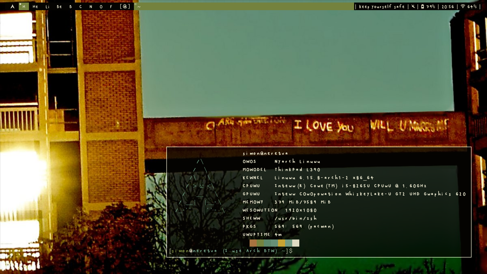

# dwm 

Figure 1. Newest rice pic but still a bit outdated.

> [!NOTE]
> There are some absolute paths in `config.h` that you may have to change or remove to get it to compile. Specifically regarding pywal colors and scripts in the scripts folder.

## Documentation
the code is the documentation.

## Dependencies
* Any nerd font
* [Lion Cub mono](https://github.com/SimonCantCode/LionCub_mono) (optional, the font in the first screenshot)
* Pipewire and wireplumber
* [mybar](https://github.com/SimonCantCode/mybar) for the bar (optional)

### AUR Dependencies
* Brillo
* libinput-gestures (optional)
